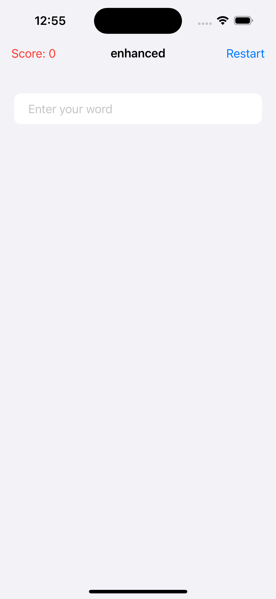
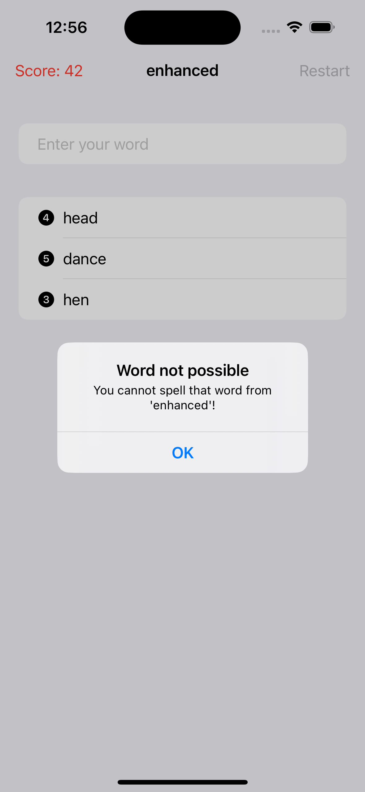
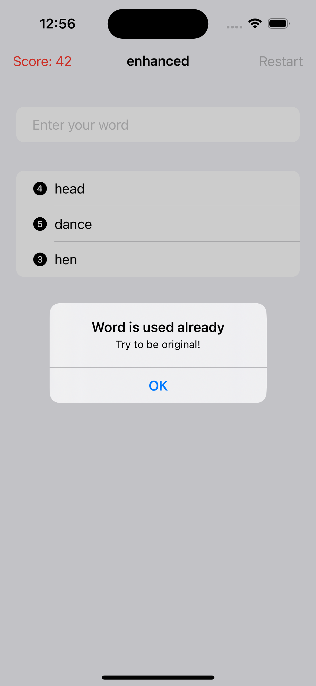
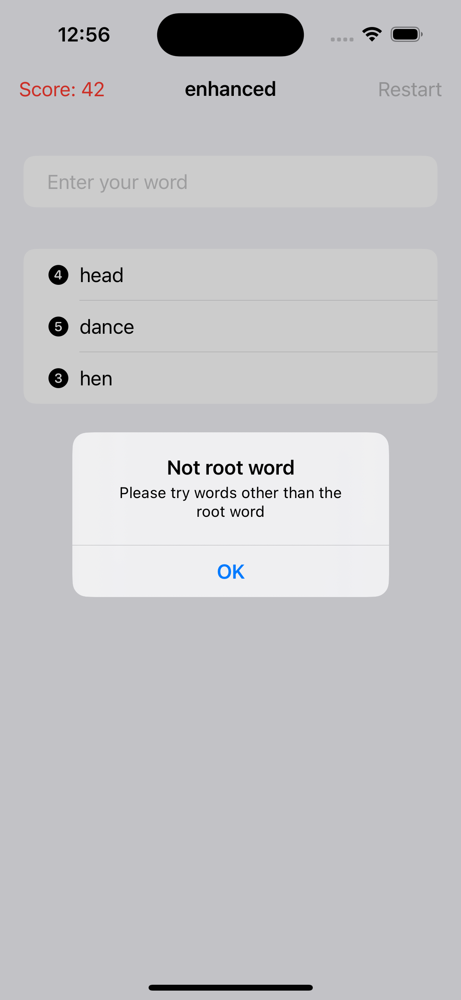
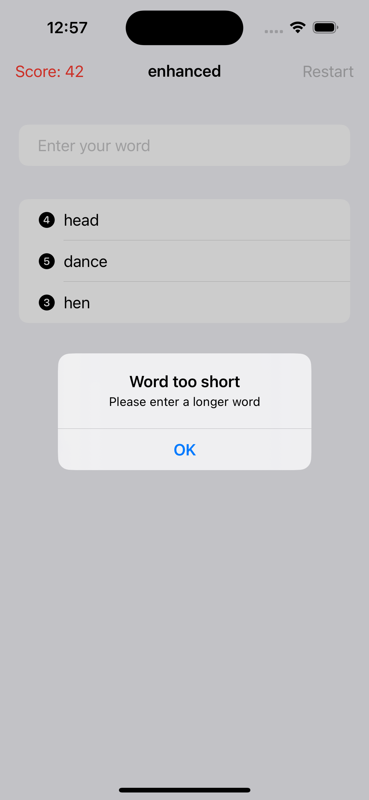

# WordScramble iOS App

WordScramble is a challenging and addictive word game for iOS devices. Test your vocabulary and word-solving skills by unscrambling letters to form new words. The game provides a unique twist on traditional word games, requiring players to create original words that are possible to spell using the given letters.

## Features

- Unscramble letters to form new words.
- Choose from a diverse list of over 10,000 8-letter words.
- Words must be original, possible to spell from the given letters, and valid English words.
- Track your score based on the number of words solved and the total letters in those words.
<!-- - Multiple difficulty levels to suit players of different skill levels.
- Time pressure option adds an extra challenge.
- Earn power-ups and hints to aid in solving difficult words.
- Global leaderboards to compete with players from around the world.
- Daily challenges with new words every day.
- Educational element with word definitions provided. -->

## Installation

1. Clone this repository to your local machine using: `git clone https://github.com/YourUsername/WordScramble.git`

2. Open the project in Xcode.

3. Build and run the app on a simulator or a physical iOS device.

## Screenshots

## Usage

1. Launch the app on your iOS device.

2. A random 8-letter word will be displayed at the top.

3. Unscramble the letters to form new words. Each new word must be original, possible to spell from the given letters, and a valid English word.

4. Earn points for each successfully unscrambled word.

## Contributing

Contributions are welcome! If you find any issues or would like to add new features, follow these steps:

1. Fork the repository.

2. Create a new branch for your feature/bug fix: `git checkout -b feature-name`.

3. Make your changes and commit them: `git commit -m 'Add some feature'`.

4. Push to the branch: `git push origin feature-name`.

5. Submit a pull request.
